## Exercise 3: Configure VMWare Environments for failover.
**Contents**

<!-- TOC -->

- [Exercise 3: Configure VMWare Environments for failover](#exercise-3-configure-vmware-environments-for-failover)
    - [Task 1: Prepare VMWare environment](#task-1-prepare-vmware-environment)
    - [Task 2: Deploy the Configuration Server](#task-2-deploy-the-configuration-server)
    - [Task 3: Finalize Azure Environment and Create the First Replication](#task-3-finalize-azure-environment-and-create-the-first-replication)
    - [Task 4: Enable Virtual Machine Protection Replication](#task-4-enable-virtual-machine-protection-replication)
    - [Task 5: Simulate Test Failover *Optional*](#task-5-simulate-test-failover)

<!-- /TOC -->

Duration: 45 minutes

In this exercise, you will configure the VMWare environments to use BCDR technologies found in Azure. The environment has unique configurations that must be completed to ensure their availability in the event of a disaster.

### Task 1: Prepare VMWare environment

1. From the Azure portal, open the **BCDRCLOUDSRV** Recovery Services Vault located in the **BCDRRG** resource group.

2. Select **Site Recovery** in the **Getting Started** area of **BCDRCLOUDSRV** blade.

    

3. Next, select **Prepare Infrastructure** in the **For On-Premises Machines** section. This will start you down a path of various steps to configure your VM that is running on VMWare on-premises to be replicated to Azure.

	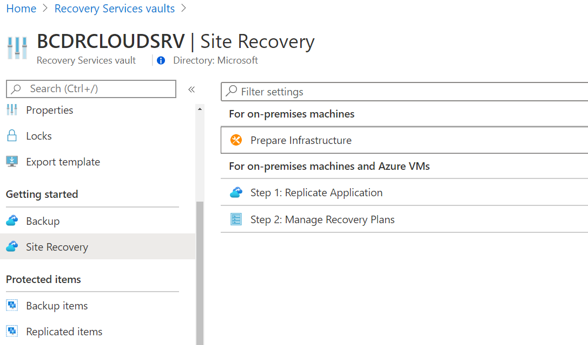

4. On **Step 1 Protection Goal** select the following inputs and then select **OK**:

    - **Where are your machines located?**: On-premises
    - **Where do you want to replicate your machines to?**: To Azure
    - **Are you performing a migration?**: No
    - **I understand, but I would like to continue with Azure Site Recovery**: checked
    - **Are your machines virtualized?**: `Yes, with VMware vSphere Hypervisor`
	Press **OK**

	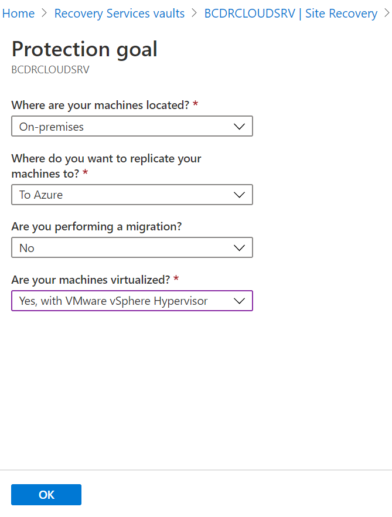

5. In **Deployment planning** `Have you completed deployment planning?`, select **Yes, I have Done it** and click **OK**

    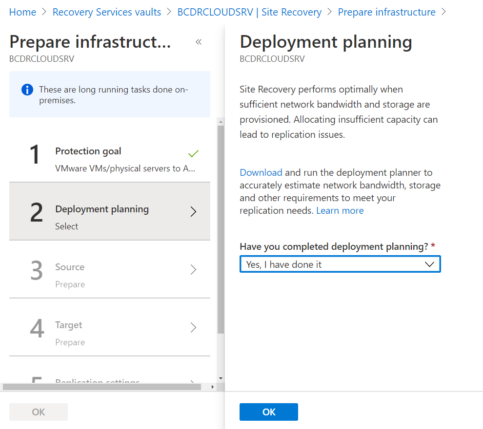

6. In **Prepare Source** click **+ Configuration Server**

	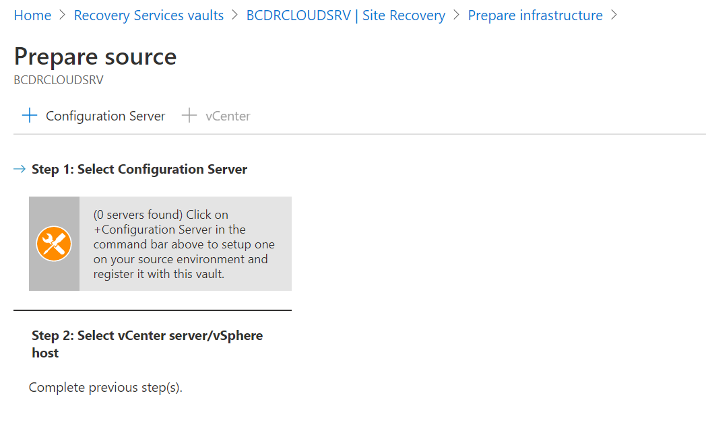
7. From here you can download the configuration server.

	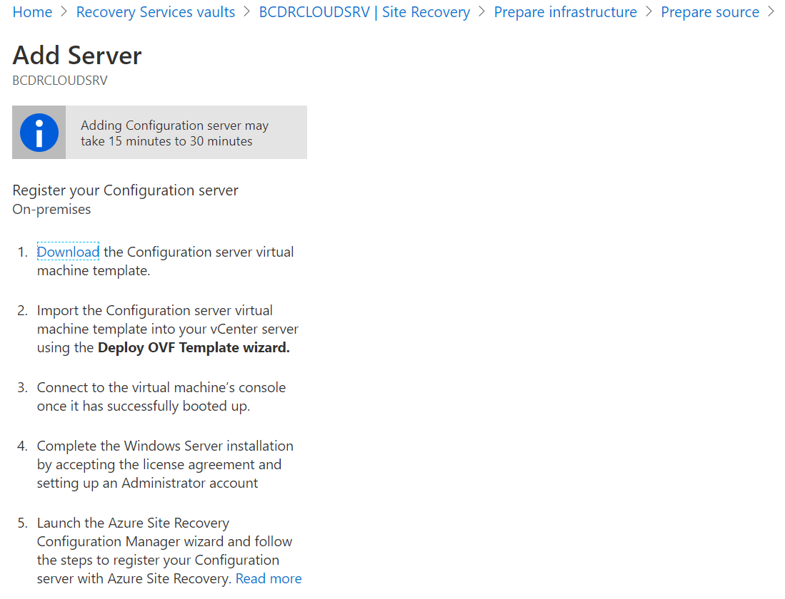

### Task 2: Deploy the Configuration Server

1. Go to **VMWare VCenter** and create a new *Role* with name **Azure\_Site\_Recovery**

2. Give the following permission to the role:

	**Task** | **Role/Permissions** | **Details**
	--- | --- | ---
	**VM discovery** | At least a read-only user   Data Center object –> Propagate to Child Object, role=Read-only | User assigned at datacenter level, and has access to all the objects in the datacenter.   To restrict access, assign the **No access** role with the **Propagate to child** object, to the child objects (vSphere hosts, datastores, VMs and networks).
	**Full replication, failover, failback** |  Create a role (Azure_Site_Recovery) with the required permissions, and then assign the role to a VMware user or group   Data Center object –> Propagate to Child Object, role=Azure_Site_Recovery   Datastore -> Allocate space, browse datastore, low-level file operations, remove file, update virtual machine files   Network -> Network assign   Resource -> Assign VM to resource pool, migrate powered off VM, migrate powered on VM   Tasks -> Create task, update task   Virtual machine -> Configuration   Virtual machine -> Interact -> answer question, device connection, configure CD media, configure floppy media, power off, power on, VMware tools install   Virtual machine -> Inventory -> Create, register, unregister   Virtual machine -> Provisioning -> Allow virtual machine download, allow virtual machine files upload   Virtual machine -> Snapshots -> Remove snapshots | User assigned at datacenter level, and has access to all the objects in the datacenter.   To restrict access, assign the **No access** role with the **Propagate to child** object, to the child objects (vSphere hosts, datastores, VMs and networks).
	
	create a new user **LabLocal** and assign the role to the user.
	
	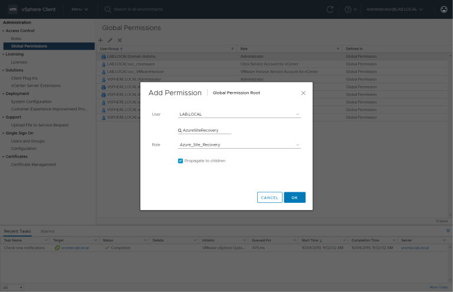
	
	Prepare a domain or local account with permissions to install on the VM for the mobility service push deployment.
	
	- **Windows VMs**: To install on Windows VMs if you're not using a domain account, disable Remote User Access
	   control on the local machine. To do this, in the registry > **HKEY_LOCAL_MACHINE\SOFTWARE\Microsoft\Windows\CurrentVersion\Policies\System**, add the
	     DWORD entry **LocalAccountTokenFilterPolicy**, with a value of 1.
	- **Linux VMs**: To install on Linux VMs, prepare a root account on the source Linux server.

 
3. Sign in to the VMware vCenter server or vSphere ESXi host by using the VMWare vSphere Client.

4. On the **File** menu, select **Deploy OVF Template** to start the **Deploy OVF Template** wizard.

     

5. On **Select source**, enter the location of the downloaded OVF.

6. On **Review details**, select **Next**.

7. On **Select name and folder** and **Select configuration**, accept the default settings.

8. On **Select storage**, for best performance select **Thick Provision Eager Zeroed** in **Select virtual disk format**. Use of the thin provisioning option might affect the performance of the configuration server.

9. On the rest of the wizard pages, accept the default settings.

10. On **Ready to complete**:

    * To set up the VM with the default settings, select **Power on after deployment** > **Finish**.
    * To add an additional network interface, clear **Power on after deployment**, and then select **Finish**. By default, the configuration server template is deployed with a single NIC. You can add additional NICs after deployment.

11. From the VMWare vSphere Client console, turn on the **VM**.

12. The VM boots up into a Windows Server 2016 installation experience. `Accept the license agreement`, and enter an **administrator password**.

13. After the installation finishes, sign in to the VM as the administrator.

14. The first time you sign in, within a few seconds the **Azure Site Recovery Configuration tool** starts.

15. Enter a name that's used to register the configuration server with Site Recovery. Then select **Next**.

16. The tool checks that the VM can connect to Azure. After the connection is established, select **Sign in** to sign in to your Azure subscription. 
    a. The credentials must have access to the vault in which you want to register the configuration server. 
    b. Ensure that the chosen user account has permission to create an application in Azure. To enable the required permissions, follow the guidelines in the section [Azure Active Directory permission requirements](#azure-active-directory-permission-requirements).

17. The tool performs some configuration tasks, and then reboots.

18. Sign in to the machine again. The configuration server management wizard starts automatically in a few seconds.
	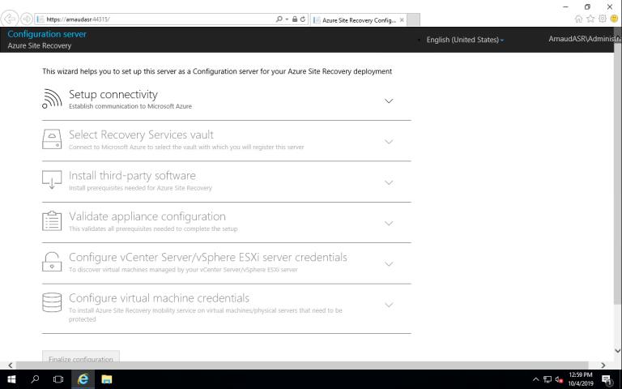

19. In the configuration server management wizard, select **Setup connectivity**. From the drop-down boxes, first select the NIC that the in-built process server uses for discovery and push installation of mobility service on source machines. Then select the NIC that the configuration server uses for connectivity with Azure. Select **Save**. You can't change this setting after it's configured. Don't change the IP address of a configuration server. Ensure that the IP assigned to the configuration server is a static IP and not a DHCP IP.

20. On **Select Recovery Services vault**, sign in to Microsoft Azure with the credentials used in step 6 of [Register the configuration server with Azure Site Recovery services](#register-the-configuration-server-with-azure-site-recovery-services).

21. After sign-in, select your Azure subscription and the relevant resource group and vault.

22. On **Install third-party software**:

    |Scenario   |Steps to follow  |
    |---------|---------|
    |I want to download and install MySQL through Azure Site Recovery.    |  Accept the license agreement, and select **Download and install**. After installation finishes, proceed to the next step.       |

23. On **Validate appliance configuration**, prerequisites are verified before you continue.

24. On **Configure vCenter Server/vSphere ESXi server**, enter the FQDN or IP address of the vCenter server, or vSphere host, where the VMs you want to replicate are located. Enter the port on which the server is listening. Enter a friendly name to be used for the VMware server in the vault.

25. Enter credentials to be used by the configuration server to connect to the VMware server. Site Recovery uses these credentials to automatically discover VMware VMs that are available for replication. Select **Add** > **Continue**. The credentials entered here are locally saved.

26. On **Configure virtual machine credentials**, enter the user name and password of virtual machines to automatically install mobility service during replication. For **Windows** machines, the account needs local administrator privileges on the machines you want to replicate. For **Linux**, provide details for the root account.

27. Select **Finalize configuration** to complete registration.
	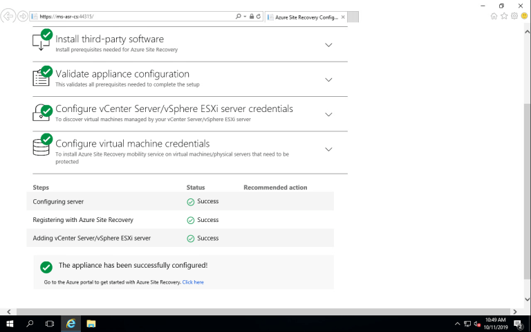

28. After registration finishes, open the Azure portal and verify that the configuration server and VMware server are listed on **Recovery Services Vault** > **Manage** > **Site Recovery Infrastructure** > **Configuration Servers**.

### Task 3: Finalize Azure Environment and Create the First Replication

1. You will need to return to the **Step 2 Prepare Source** screen and select **+vCenter/vSphere host**. Enter the details and Select your **vCenter** host.

    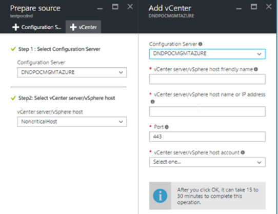

2. Select **OK**.

3. On **Step 3 Target Prepare** review the screen to better understand the various steps. Select **+Storage account** to add a storage account that will be used for the **VMWare** when it is failed over to Azure.

    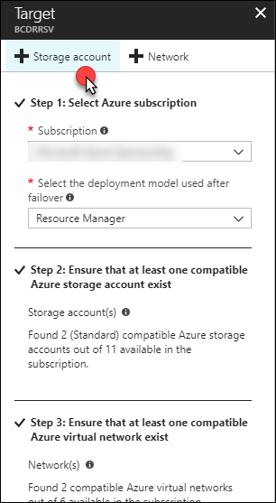

4. Select **Create New** and provide a unique name for your storage account containing the name of the VM **choose a name** with added characters to make it unique. Also, select the Premium tier for the storage account and select **OK**.

    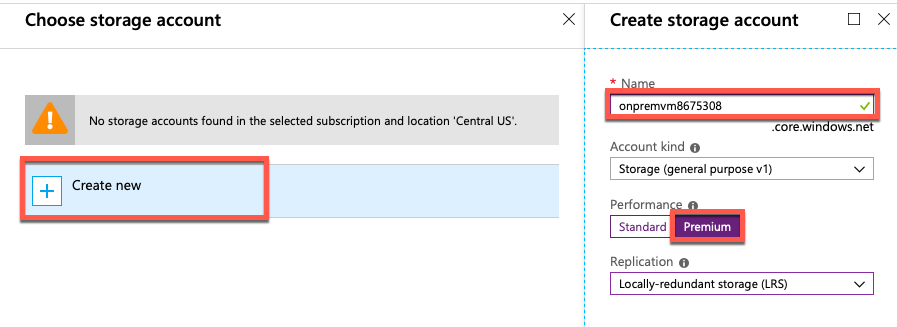

5. Select **+Storage account** again and create a second storage account using the **Standard** performance tier, then select **OK**.

6. The portal will submit a deployment, and you must wait until this completes. It will be created in the **BCDRRG** resource group.
  
    

7. You will be failing the **On Premises Virtual Machine** into the **Azure** site that was deployed earlier, so you already have a Virtual Networks created. Select **OK** on the Target blade to continue.

    

8. On the **Replication Policy** screen, select the **+Create and Associate** item.

9. Enter the name: `OnPremVM-POL`. Review the settings that you can configure and then select **OK**.

    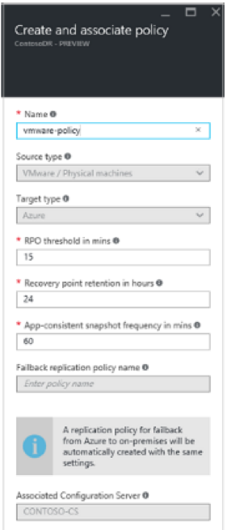

	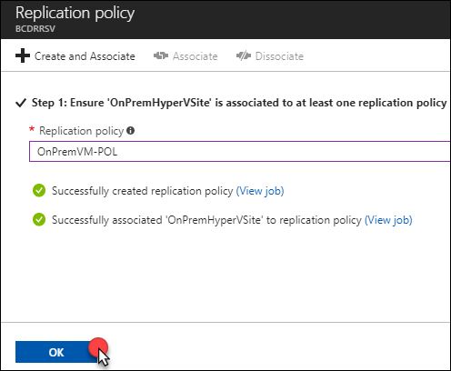

### Task 4: Enable Virtual Machine Protection Replication

1. Select **Replicate application** > **Source**.

	
 
2. In **Source**, select **On-premises**, and select the configuration server in **Source location**.
 
3. In **Machine type**, select **Virtual Machines**.
 
4. In **vCenter/vSphere Hypervisor**, select the vSphere host, or vCenter server that manages the host.

5. Select the process server (installed by default on the configuration server VM). Then select **OK**. Health status of each process server is indicated as per recommended limits and other parameters. Choose a healthy process server.
	
	

6. In **Target**, select the subscription and the resource group in which you want to create the failed-over VMs. We're using the Resource Manager deployment model.

7. Select the Azure network and subnet **Cloud\_VNet\_Production** to which Azure VMs connect when they're created after failover.

	

8. Select **Configure now for selected machines** to apply the network setting to all VMs on which you enable replication. Select **Configure later** to select the Azure network per machine.

	

9. In **Virtual Machines** > **Select virtual machines**, select each machine you want to replicate. You can only select machines for which replication can be enabled. Then select **OK**.

10. In **Properties** > **Configure properties**, select the account to be used by the process server to automatically install Mobility Service on the machine.

	

11. In **Replication settings** > **Configure replication settings**, verify that the correct replication policy is selected.

12. Select **Enable Replication**. Site Recovery installs the Mobility Service when replication is enabled for a VM.

	

13. You can track progress of the **Enable Protection** job in **Settings** > **Jobs** > **Site Recovery Jobs**. After the **Finalize Protection** job runs and a recovery point generation is complete, the machine is ready for failover.

14. It can take 15 minutes or longer for changes to take effect and appear in the portal.

15. To monitor VMs you add, check the last discovered time for VMs in **Configuration Servers** > **Last Contact At**. To add VMs without waiting for the scheduled discovery, highlight the configuration server (don't select it) and select **Refresh**.

### Task 5: Simulate Test Failover *Optional*

On this task you will simulate the and use the **Test Failover Functionality** of Site Recovery vault.

1. From the Azure portal, open the **BCDRCLOUDSRV** Recovery Services Vault located in the **BCDRRG** resource group.

 
2. Open the **BCDRCLOUDSRV** and select **Replicated Items** under the **Protected Items** area. Make sure that **OnPremVM** shows up ad **Replication Heath**: **Healthy.** Select **OnPremVM**.

    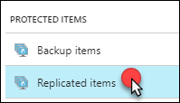

    

3. Right-click **OnPremVM** and then select **Test Failover**.

    

4. Select you your latest **recovery point**  verify that **From** is set to **MyOnPremSite** and **To** is set to **Microsoft Azure**, for **Azure virtual network** choose **Cloud\_DR\_Network** and press **OK**.

    

5. The Azure portal will provide a notification that the Test failover is starting.

    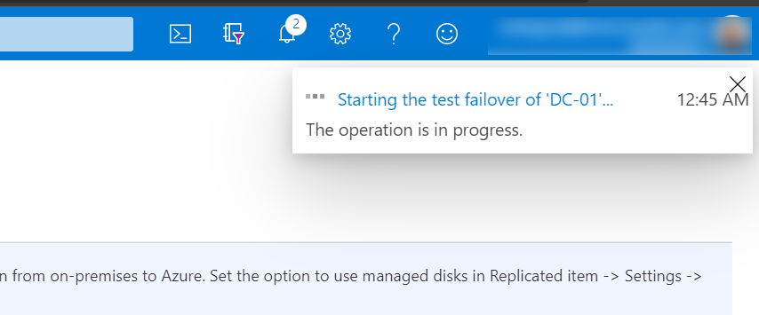

6. By selecting Site Recovery Jobs, you can monitor the progress of the failover.

    

7. Once the Failover Status is *Successful* in Site Recovery Jobs, go to **Virtual Machines** and you will see your **OnPremVM** with status **Running**.

    

8. In order to access the Virtual Machine **OnPremVM** you need to deploy a Virtual Machine in this network because it is isolated.

9. When you finish your health check go again back to **BCDRCLOUDSRV** Site Recovery vault in the _Replicated items_. You will see your **OnPremVM** with status **Cleanup test ...**. 

10. Go to the left side on **...** and when the new blade appears select **Cleanup test failover**.

    

11. Enter your Notes for the testing, Check **Testing is Complete** and press **OK**. This will delete your Test Failover Virtual Machine.

